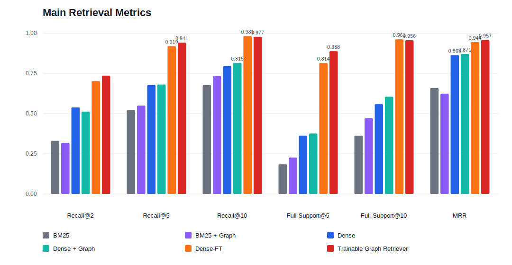
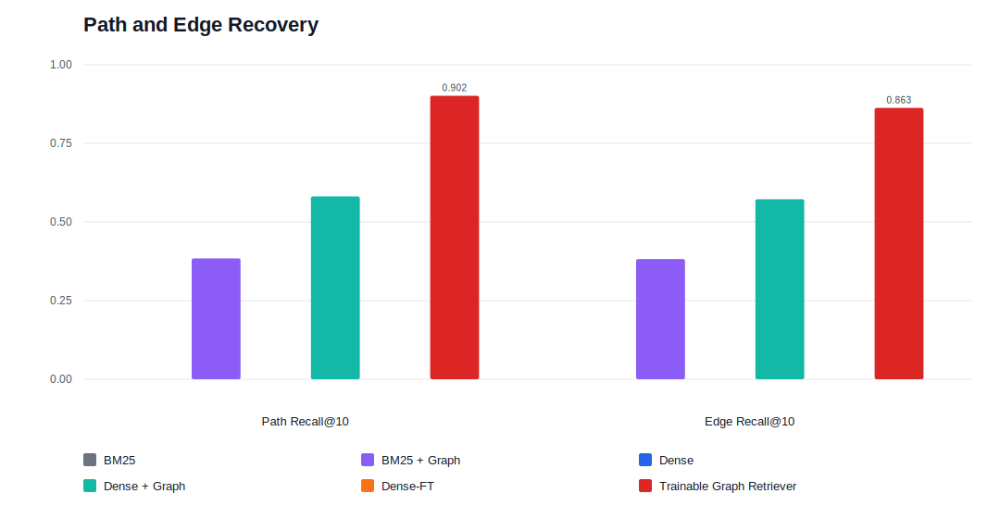
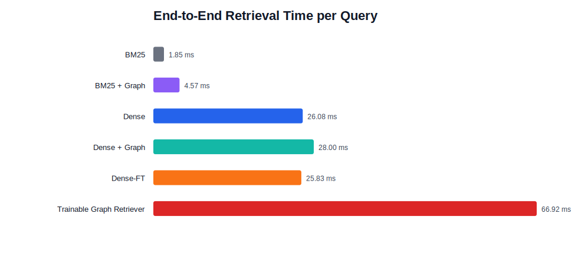

# 2WikiMultiHopQA 证据检索事实记录

## 1. 数据规模

| 数据切分 | 问题数 | 平均候选记忆数 | 平均图边数 | 孤立记忆节点数 |
|---|---:|---:|---:|---:|
| Train | 167,454 | 31.95 | 180.72 | 21,858 |
| Dev | 500 | 31.76 | 186.22 | 59 |
| Test | 12,076 | 32.92 | 192.93 | 1,907 |

训练侧包含 `3,237,914` 个图检索训练 pair，其中正例 `404,884` 个。Dense-FT 训练侧包含 `2,428,267` 个训练 pair。

## 2. 主检索指标

| 方法 | Recall@2 | Recall@5 | Recall@10 | Full Support@5 | Full Support@10 | MRR |
|---|---:|---:|---:|---:|---:|---:|
| BM25 | 0.3306 | 0.5233 | 0.6774 | 0.1846 | 0.3624 | 0.6593 |
| BM25 + Graph | 0.3178 | 0.5498 | 0.7345 | 0.2271 | 0.4722 | 0.6237 |
| Dense | 0.5383 | 0.6776 | 0.7953 | 0.3628 | 0.5586 | 0.8633 |
| Dense + Graph | 0.5124 | 0.6807 | 0.8153 | 0.3761 | 0.6046 | 0.8706 |
| Dense-FT | 0.7019 | 0.9190 | 0.9814 | 0.8143 | 0.9615 | 0.9444 |
| Trainable Graph Retriever | 0.7359 | 0.9410 | 0.9771 | 0.8876 | 0.9559 | 0.9572 |

Trainable Graph Retriever 的 `Recall@2` 比 Dense-FT 高 `4.8%`，`Recall@5` 比 Dense-FT 高 `2.4%`，`Full Support@5` 比 Dense-FT 高 `9.0%`，`MRR` 比 Dense-FT 高 `1.4%`。

Dense-FT 的 `Recall@10` 比 Trainable Graph Retriever 高 `0.4%`，`Full Support@10` 比 Trainable Graph Retriever 高 `0.6%`。

Dense-FT 的 `Full Support@10` 比 Dense 高 `72.1%`。Dense + Graph 的 `Full Support@10` 比 Dense 高 `8.2%`。BM25 + Graph 的 `Full Support@10` 比 BM25 高 `30.3%`。

从结果形态看，2WikiMultiHopQA 的候选规模和支持句数量会让 top10 指标相对宽松。Test 平均候选记忆数约为 `32.92`，训练集中平均正例约为 `2.42` 个/题；在这种设置下，经过监督训练的 Dense-FT 能够把模板化实体关系问题中的支持句排进 top10，并不意外。这个结果更多反映文本排序模型的适配效果，而不是图路径能力。

Trainable Graph Retriever 的优势更集中在靠前位置和结构恢复上，例如 `Full Support@5`、`Path Recall@10`、`Edge Recall@10`。相对而言，top10 上的小幅差异不宜单独放大。BM25 + Graph 和 Dense + Graph 的调参产物实际选择了 `max_hops=1`，但在平均边数接近 `192.93` 的较密图上，扩大 hop 也可能引入额外噪声；这一点更适合作为后续对照实验观察，而不是当前结果的直接归因。

## 3. 结构指标

| 方法 | Connected Evidence Recall@5 | Connected Evidence Recall@10 | Query-Evidence Connectivity@10 | Path Recall@10 | Edge Recall@10 |
|---|---:|---:|---:|---:|---:|
| BM25 | 0.0788 | 0.2171 | 0.3605 | N/A | N/A |
| BM25 + Graph | 0.1264 | 0.3303 | 0.4717 | 0.3841 | 0.3820 |
| Dense | 0.2010 | 0.3968 | 0.5535 | N/A | N/A |
| Dense + Graph | 0.2341 | 0.4487 | 0.6013 | 0.5813 | 0.5722 |
| Dense-FT | 0.5554 | 0.7246 | 0.9432 | N/A | N/A |
| Trainable Graph Retriever | 0.5847 | 0.6977 | 0.9374 | 0.9015 | 0.8626 |

Trainable Graph Retriever 的 `Path Recall@10` 比 Dense + Graph 高 `55.1%`，`Edge Recall@10` 比 Dense + Graph 高 `50.7%`。

Dense-FT 的 `Connected Evidence Recall@10` 比 Trainable Graph Retriever 高 `3.9%`，`Query-Evidence Connectivity@10` 比 Trainable Graph Retriever 高 `0.6%`。Trainable Graph Retriever 的 `Connected Evidence Recall@5` 为 `0.5847`，Dense-FT 为 `0.5554`。

BM25、Dense、Dense-FT 的 `Path Recall@10` 和 `Edge Recall@10` 记录为 `N/A`。BM25 + Graph、Dense + Graph、Trainable Graph Retriever 有对应的路径与边恢复指标。

## 4. 效率指标

| 方法 | 端到端耗时 / Query | 平均候选记忆数 | 平均返回边数 |
|---|---:|---:|---:|
| BM25 | 1.85 ms | 31.92 | 0.00 |
| BM25 + Graph | 4.57 ms | 31.92 | 36.08 |
| Dense | 26.08 ms | 31.92 | 0.00 |
| Dense + Graph | 28.00 ms | 31.92 | 39.90 |
| Dense-FT | 25.83 ms | 31.92 | 0.00 |
| Trainable Graph Retriever | 66.92 ms | 31.92 | 29.33 |

Trainable Graph Retriever 的耗时比 Dense-FT 高 `159.1%`，比 Dense 高 `156.6%`。Dense + Graph 比 Dense 高 `7.4%`。

Trainable Graph Retriever 的平均返回边数为 `29.33`。Dense + Graph 的平均返回边数为 `39.90`，BM25 + Graph 的平均返回边数为 `36.08`。
