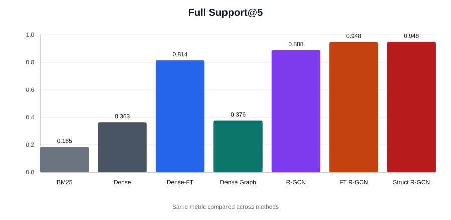
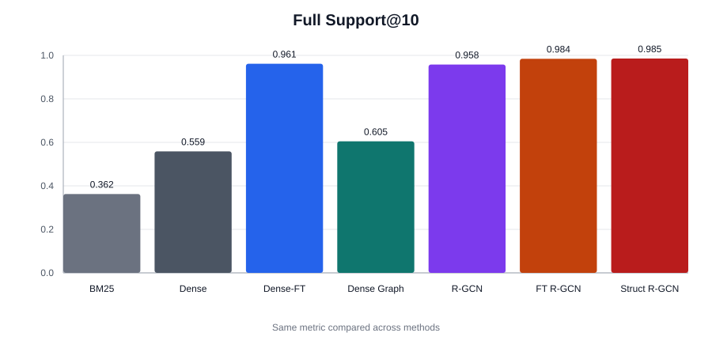
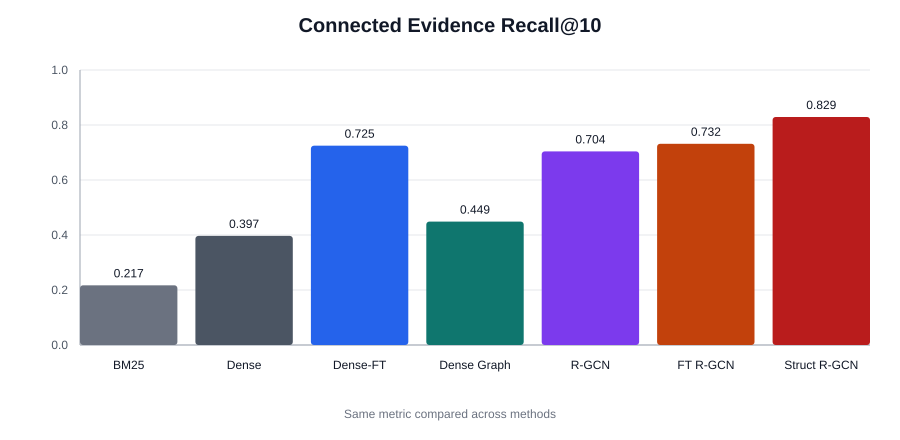
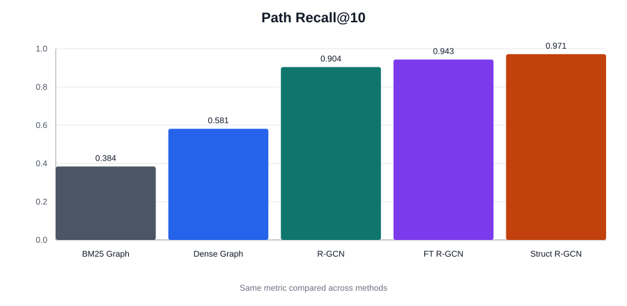
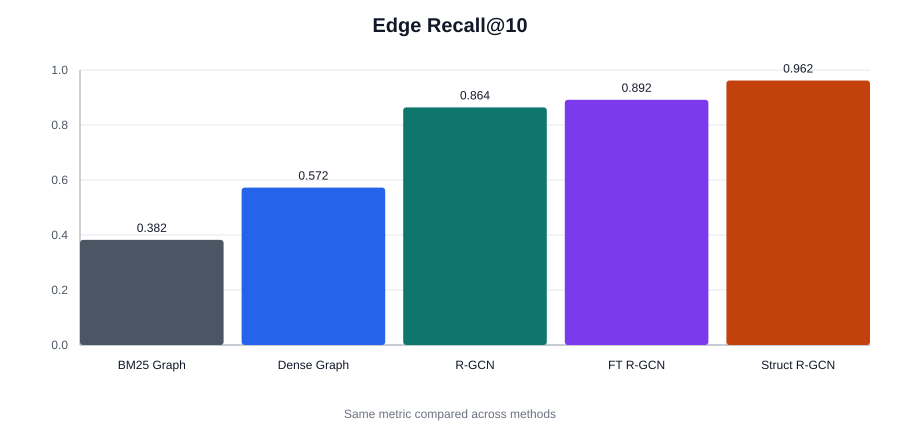

# 2WikiMultiHopQA 结构化图检索阶段性结果

本报告记录同一 2WikiMultiHopQA 评测设置下的阶段性结果。测试集包含 `12,076` 个问题，每题平均候选证据约 `31.92` 条，所有方法均按 top10 输出进行比较。

本轮新增结果主要关注证据关系的组织方式。表中的 `Structure-Aware R-GCN Retriever` 指在原有 R-GCN 图检索框架上，调整证据图构建过程后的版本；核心模型仍为 R-GCN，差异主要体现在进入图模型前的结构关系组织。

## 1. 主检索指标

| 方法 | Recall@2 | Recall@5 | Recall@10 | Full Support@5 | Full Support@10 | MRR |
|---|---:|---:|---:|---:|---:|---:|
| BM25 | 0.3306 | 0.5233 | 0.6774 | 0.1846 | 0.3624 | 0.6593 |
| Dense | 0.5383 | 0.6776 | 0.7953 | 0.3628 | 0.5586 | 0.8633 |
| Dense-FT | 0.7019 | 0.9190 | 0.9814 | 0.8143 | 0.9615 | 0.9444 |
| Dense + Graph | 0.5124 | 0.6807 | 0.8153 | 0.3761 | 0.6046 | 0.8706 |
| R-GCN Graph Retriever | 0.7324 | 0.9413 | 0.9780 | 0.8879 | 0.9579 | 0.9540 |
| Dense-FT R-GCN Graph Retriever | 0.7890 | 0.9729 | 0.9918 | 0.9477 | 0.9843 | 0.9781 |
| Structure-Aware R-GCN Retriever | 0.7863 | 0.9729 | 0.9926 | 0.9482 | 0.9854 | 0.9709 |

主指标中，`Dense-FT R-GCN Graph Retriever` 与 `Structure-Aware R-GCN Retriever` 位于同一水平段。后者的 `Full Support@5` 为 `0.9482`，前者为 `0.9477`；`Full Support@10` 分别为 `0.9854` 与 `0.9843`。两项完整支持指标的绝对差值均低于 `0.002`。

`Recall@10` 也呈现接近状态，`Structure-Aware R-GCN Retriever` 为 `0.9926`，`Dense-FT R-GCN Graph Retriever` 为 `0.9918`。相对而言，`MRR` 从 `0.9781` 变为 `0.9709`，说明更完整的 top10 覆盖并未同步转化为更靠前的首个正确证据排序。

## 2. 结构恢复指标

| 方法 | Connected Evidence Recall@10 | Path Recall@10 | Edge Recall@10 |
|---|---:|---:|---:|
| BM25 + Graph | 0.3303 | 0.3841 | 0.3820 |
| Dense + Graph | 0.4487 | 0.5813 | 0.5722 |
| R-GCN Graph Retriever | 0.7041 | 0.9039 | 0.8639 |
| Dense-FT R-GCN Graph Retriever | 0.7318 | 0.9433 | 0.8916 |
| Structure-Aware R-GCN Retriever | 0.8292 | 0.9712 | 0.9618 |

结构指标的变化更集中。与 `Dense-FT R-GCN Graph Retriever` 相比，`Structure-Aware R-GCN Retriever` 的 `Connected Evidence Recall@10` 从 `0.7318` 到 `0.8292`，绝对提升 `0.0974`；`Path Recall@10` 从 `0.9433` 到 `0.9712`，绝对提升 `0.0278`；`Edge Recall@10` 从 `0.8916` 到 `0.9618`，绝对提升 `0.0702`。

这组结果表明，新一轮结构关系组织策略更容易覆盖 gold dependency path 与 gold dependency edge。相比之下，完整支持句是否同时进入 top5/top10 的指标已经接近饱和，因此新增结构覆盖没有在 `Full Support` 上表现为同等幅度的增长。

## 3. 检索输出形态

| 方法 | 检索耗时 / Query | 平均返回节点数 | 平均返回边数 |
|---|---:|---:|---:|
| Dense-FT | 21.43 ms | 10.00 | 0.00 |
| Dense-FT R-GCN Graph Retriever | 33.69 ms | 10.00 | 29.15 |
| Structure-Aware R-GCN Retriever | 38.23 ms | 10.00 | 40.03 |

`Structure-Aware R-GCN Retriever` 平均返回边数为 `40.03`，高于 `Dense-FT R-GCN Graph Retriever` 的 `29.15`。这与结构指标的提升方向一致：返回结果中包含了更多可用于连接支持证据的关系信息。

与此同时，检索耗时从 `33.69 ms/query` 增至 `38.23 ms/query`。在当前结果中，结构恢复的提升比完整支持指标的变化更明显，而额外结构输出也带来了可观察的推理成本。

## 4. 阶段性观察

在本轮结果中，文本微调后的图检索基线已经把 `Full Support@10` 推到 `0.9843`。新结构策略进一步达到 `0.9854`，但增幅很小；`Full Support@5` 同样只从 `0.9477` 到 `0.9482`。

更清晰的差异出现在路径和边层面。`Path Recall@10` 达到 `0.9712`，`Edge Recall@10` 达到 `0.9618`，均高于已有图检索基线。也就是说，本阶段的主要变化更像是结构覆盖质量的改善，而不是完整支持句指标上的明显跃迁。
