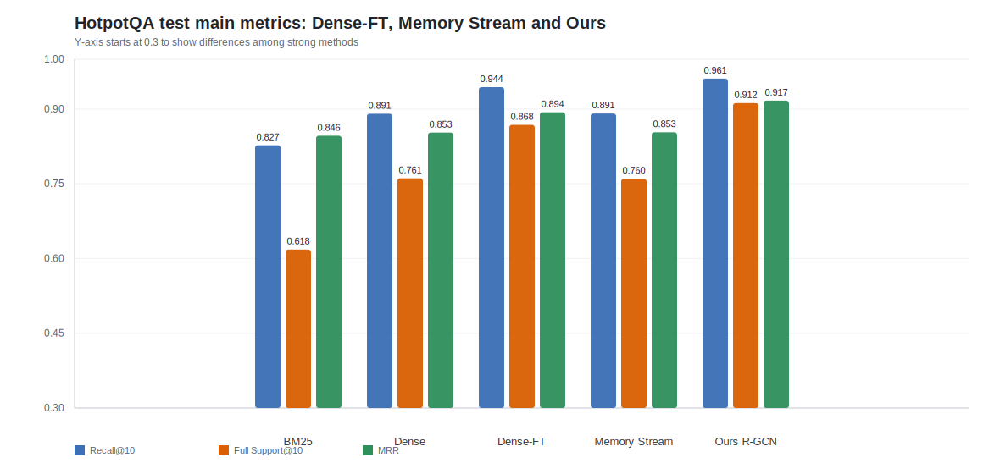
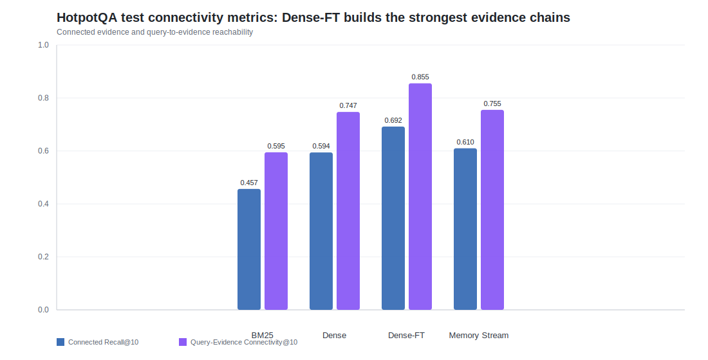
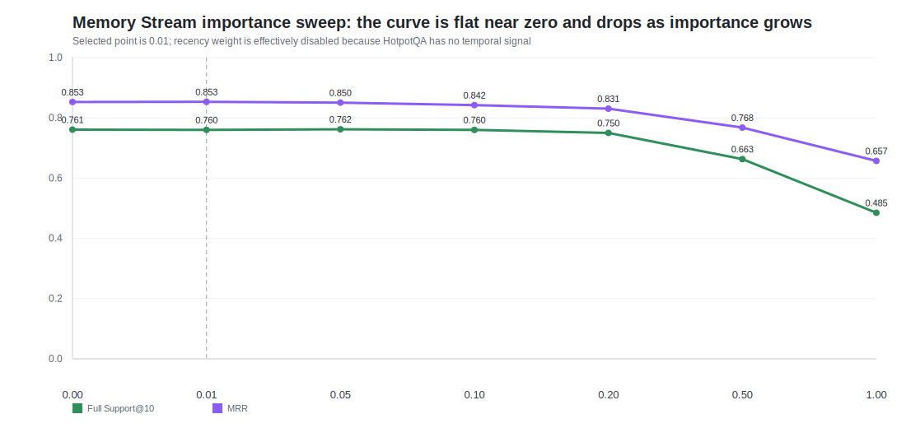

# Dense-FT 与 Memory Stream 阶段性效果报告

## 1. 核心结论

这轮结果显示，`Dense-FT` 相比普通 dense 检索有明显提升；`Memory Stream` 的主要指标基本贴近普通 dense 检索。

在同一测试集上，`Dense-FT` 把 `Full Support@10` 提到 `0.8684`，`MRR` 提到 `0.8935`，都明显高于 dense 基线。`Memory Stream` 的 `Full Support@10=0.7600`，几乎和 dense 的 `0.7610` 持平，`MRR=0.8533` 也只是微弱变化。

从结果上看，`Dense-FT` 的完整证据找回和排序指标都高于 dense 基线；`Memory Stream` 的指标变化很小。

## 2. 数据与实验规模

`Dense-FT` 训练用的是 HotpotQA 训练集上的大规模 pair 数据，合计 `90,025` 个训练任务、`1,286,226` 个训练 pair，其中正例 `214,644` 个。负例主要来自随机负例、BM25 hard negative 和图邻居 hard negative。

`Memory Stream` 这边用的是 1,000 个 task 的 importance 标注结果，一共覆盖 `41,185` 个 memory item，平均每个 task 大约 `41.2` 个 item。这个规模不小，不是少量样本试出来的趋势。

importance 标注的过程是：先尝试使用离线 7B 级别大模型做批量标注，但输出 JSON 不稳定，甚至出现结构无法闭合的问题；之后改成由 Codex 调用子代理，用 `GPT-5.4-mini` 对每个 task 中的 memory item 打 1-10 分。最终得到 1,000 个 task、41,185 个 memory item 的 importance 分数。

## 3. 主结果

| 方法 | Recall@10 | Full Support@10 | MRR |
|---|---:|---:|---:|
| BM25 | 0.8273 | 0.6180 | 0.8465 |
| Dense | 0.8906 | 0.7610 | 0.8527 |
| Dense-FT | **0.9440** | **0.8684** | **0.8935** |
| Memory Stream | 0.8911 | 0.7600 | 0.8533 |
| Ours: R-GCN Graph Retriever | **0.9611** | **0.9119** | **0.9170** |

`Dense-FT` 相比 dense，`Full Support@10` 提升了 `+0.1144`，`MRR` 提升了 `+0.0406`。`Ours: R-GCN Graph Retriever` 的 `Full Support@10=0.9119`，是这组主指标里最高的结果。

`Memory Stream` 基本贴着 dense 走，`Full Support@10` 差值为 `-0.0010`。

## 4. 连通性表现

| 方法 | Connected Evidence Recall@10 | Query-Evidence Connectivity@10 |
|---|---:|---:|
| BM25 | 0.4565 | 0.5948 |
| Dense | 0.5944 | 0.7473 |
| Dense-FT | **0.6919** | **0.8554** |
| Memory Stream | 0.6100 | 0.7550 |

连通性结果中，`Dense-FT` 的 `Connected Evidence Recall@10` 比 dense 高 `+0.0975`，`Query-Evidence Connectivity@10` 比 dense 高 `+0.1082`。`Memory Stream` 的两个连通性指标分别比 dense 高 `+0.0156` 和 `+0.0077`。

## 5. 为什么 Memory Stream 效果一般

`Memory Stream` 的核心是 `relevance + importance + recency` 的加权，但 HotpotQA 没有真实的 recency / 时间顺序信息，所以 recency 这一项在这里天然就没有发挥空间。

剩下真正能起作用的，其实主要就是 relevance 和 importance。问题在于，这次 importance 的 grid search 没有找到一个像样的“高 importance 更好”的区间，最优点最后落在 `importance_weight = 0.01`，已经非常接近把 importance 关掉了。

从扫参曲线看得很直观：

| importance_weight | Full Support@10 | MRR |
|---|---:|---:|
| 0.00 | 0.761 | 0.8527 |
| 0.01 | 0.760 | 0.8533 |
| 0.05 | 0.762 | 0.8504 |
| 0.10 | 0.760 | 0.8423 |
| 0.20 | 0.750 | 0.8305 |
| 0.50 | 0.663 | 0.7677 |
| 1.00 | 0.485 | 0.6571 |

这条曲线显示：importance 权重从 0.10 继续增大后，`Full Support@10` 和 `MRR` 都持续下降；最佳配置落在 0.01 这个接近零权重的位置。在这组 HotpotQA 实验里，importance 没有表现出足以超过 dense 的独立增益。
