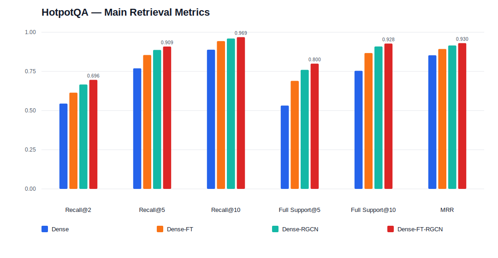
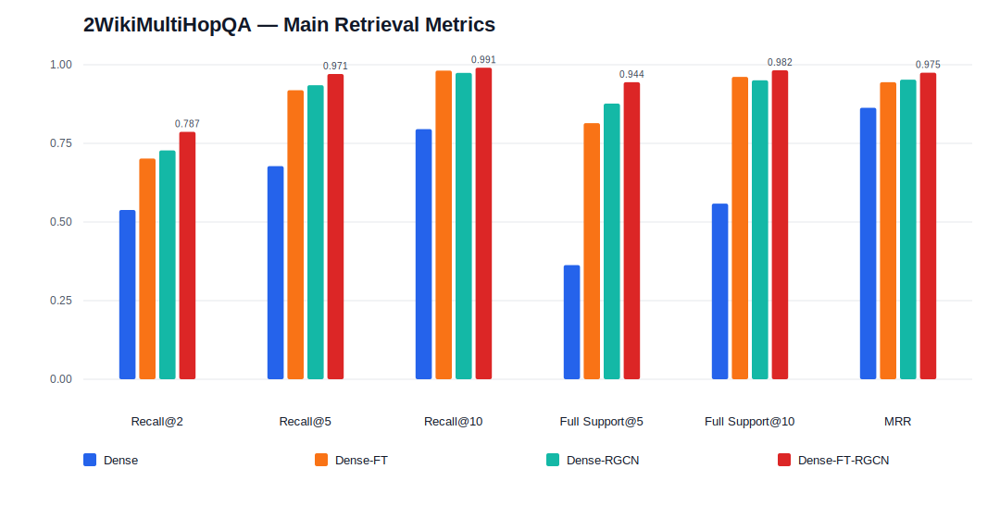
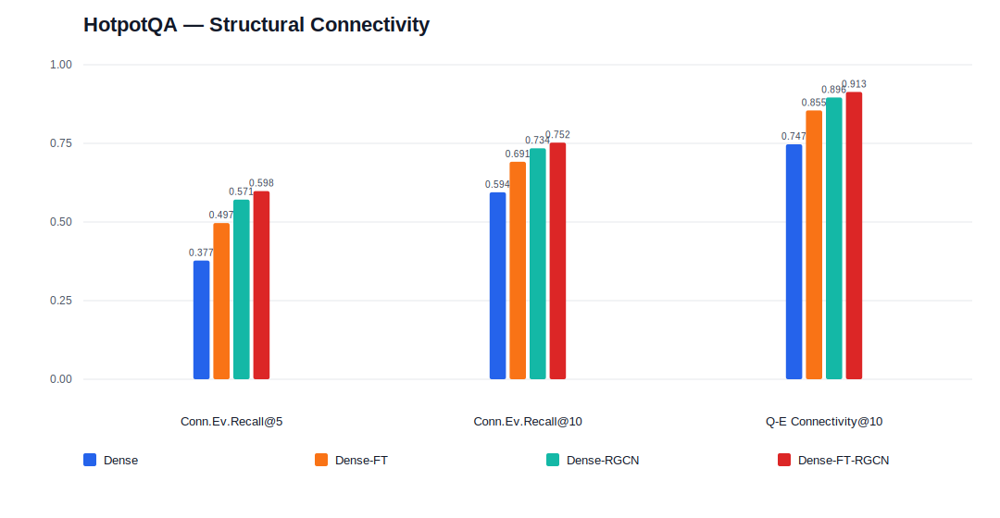
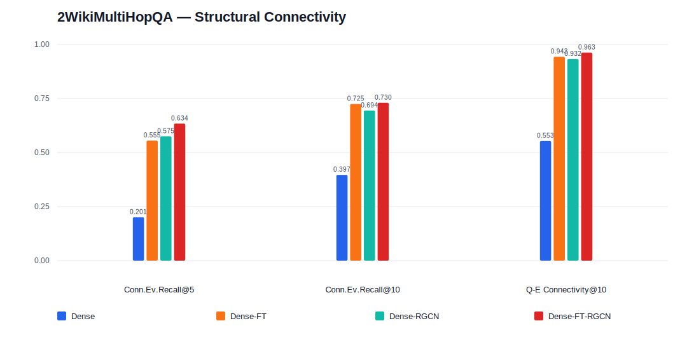
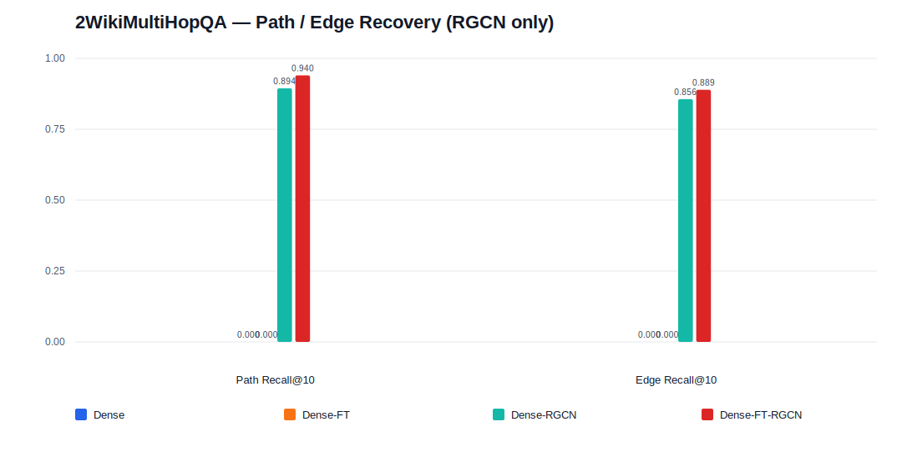
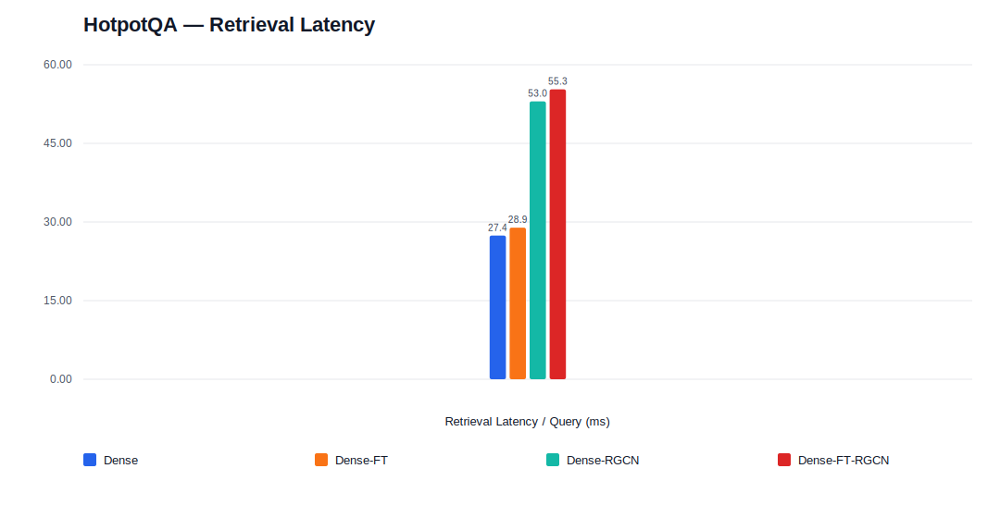
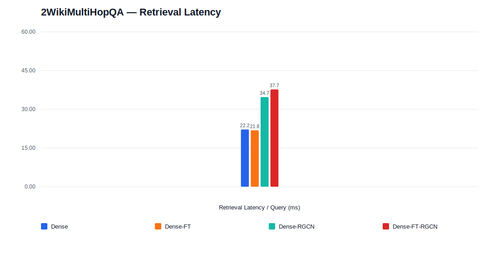

# Dense / Dense-FT 及其 R-GCN 变体跨数据集对比报告

本报告在两个多跳证据检索数据集上，对比四个方法：`Dense`、`Dense-FT`，以及分别以二者作为种子检索器的 R-GCN 图检索变体 `Dense-RGCN`、`Dense-FT-RGCN`。

四个方法的关系是：`Dense` 与 `Dense-FT` 是纯文本稠密检索（后者在目标数据上做了检索微调）；`Dense-RGCN` 与 `Dense-FT-RGCN` 在对应种子检索分数之上，用 2 层 R-GCN 对 memory 句子节点重新打分并输出 top-k 证据节点。因此每一对（Dense / Dense-RGCN、Dense-FT / Dense-FT-RGCN）可以直接看出"在同一种子上加图重排"带来的增量。

## 1. 数据规模

| 数据集 | 测试问题数 | 平均候选记忆数 | 平均返回节点数 |
|---|---:|---:|---:|
| HotpotQA | 6,869 | 41.34 | 9.99 |
| 2WikiMultiHopQA | 12,076 | 31.92 | 10.00 |

两个数据集的候选规模接近，top-k 截断都取 10。2WikiMultiHopQA 具有显式的 gold dependency path / edge 标注，因此可以评估 `Path Recall@10` 与 `Edge Recall@10`；HotpotQA 的 supporting facts 没有显式路径标注，这两项记录为 `N/A`。

## 2. 主检索指标

### 2.1 HotpotQA

| 方法 | Recall@2 | Recall@5 | Recall@10 | Evidence F1@5 | Evidence F1@10 | Full Support@5 | Full Support@10 | MRR |
|---|---:|---:|---:|---:|---:|---:|---:|---:|
| Dense | 0.5448 | 0.7698 | 0.8886 | 0.4883 | 0.3404 | 0.5320 | 0.7538 | 0.8530 |
| Dense-FT | 0.6143 | 0.8548 | 0.9436 | 0.5426 | 0.3622 | 0.6896 | 0.8675 | 0.8932 |
| Dense-RGCN | 0.6665 | 0.8871 | 0.9600 | 0.5656 | 0.3696 | 0.7599 | 0.9090 | 0.9156 |
| Dense-FT-RGCN | **0.6961** | **0.9088** | **0.9687** | **0.5800** | **0.3733** | **0.7998** | **0.9279** | **0.9305** |

四个方法在 HotpotQA 上呈现清晰的单调递增：`Dense < Dense-FT < Dense-RGCN < Dense-FT-RGCN`，`Dense-FT-RGCN` 在全部主指标上最高。

- 在同种子上加 R-GCN 的增量：`Dense-RGCN` 相对 `Dense` 的 `Full Support@10` 从 `0.7538` 升到 `0.9090`（`+0.1552`，相对 `+20.6%`），`Full Support@5` 从 `0.5320` 升到 `0.7599`（`+0.2279`，相对 `+42.8%`）。`Dense-FT-RGCN` 相对 `Dense-FT` 的 `Full Support@5` 从 `0.6896` 升到 `0.7998`（`+0.1102`，相对 `+16.0%`），`Full Support@10` 从 `0.8675` 升到 `0.9279`（`+0.0604`，相对 `+7.0%`）。
- 微调种子的增量：在都接 R-GCN 的前提下，`Dense-FT-RGCN` 相对 `Dense-RGCN` 的 `Recall@5` 高 `0.0217`，`Full Support@10` 高 `0.0189`，`MRR` 高 `0.0149`。说明 Dense-FT 种子带来的更好初始排序，会进一步被 R-GCN 放大。

### 2.2 2WikiMultiHopQA

| 方法 | Recall@2 | Recall@5 | Recall@10 | Evidence F1@5 | Evidence F1@10 | Full Support@5 | Full Support@10 | MRR |
|---|---:|---:|---:|---:|---:|---:|---:|---:|
| Dense | 0.5383 | 0.6776 | 0.7953 | 0.4229 | 0.2994 | 0.3628 | 0.5586 | 0.8633 |
| Dense-FT | 0.7019 | 0.9190 | **0.9814** | 0.5881 | 0.3792 | 0.8143 | 0.9615 | 0.9444 |
| Dense-RGCN | 0.7277 | 0.9351 | 0.9742 | 0.6036 | 0.3770 | 0.8764 | 0.9506 | 0.9525 |
| Dense-FT-RGCN | **0.7867** | **0.9706** | 0.9906 | **0.6242** | **0.3825** | **0.9444** | **0.9824** | **0.9746** |

2WikiMultiHopQA 上 `Dense-FT-RGCN` 同样在几乎所有主指标上最高，但出现一个值得注意的细节：

- `Dense-RGCN` 相对 `Dense-FT` 在靠前位置更强（`Recall@2` `0.7019→0.7277`，`Full Support@5` `0.8143→0.8764`，`+0.0621`），但在 `Recall@10` 和 `Full Support@10` 上略低（`0.9814→0.9742`、`0.9615→0.9506`）。也就是说，仅用 Dense 种子的 R-GCN 把更多证据顶到前排，但在已经很宽松的 top10 上没有超过经过微调的 Dense-FT。
- `Dense-FT-RGCN` 没有这个折衷：它在 `Full Support@5`（`0.9444`）、`Full Support@10`（`0.9824`）、`Recall@10`（`0.9906`）上都最高，相对 `Dense-FT` 的 `Full Support@5` 提升 `+0.1301`（相对 `+16.0%`），`Recall@2` 提升 `+0.0848`（相对 `+12.1%`）。

综合两个数据集，R-GCN 的增益最集中在靠前位置和完整证据找回（`Recall@2`、`Full Support@5`）；而 `Dense-FT-RGCN`（微调种子 + 图重排）是唯一在两个数据集上都不出现指标回退的方法。

## 3. 结构指标

### 3.1 HotpotQA

| 方法 | Connected Evidence Recall@5 | Connected Evidence Recall@10 | Query-Evidence Connectivity@10 | Path Recall@10 | Edge Recall@10 |
|---|---:|---:|---:|---:|---:|
| Dense | 0.3773 | 0.5944 | 0.7471 | N/A | N/A |
| Dense-FT | 0.4969 | 0.6914 | 0.8546 | N/A | N/A |
| Dense-RGCN | 0.5711 | 0.7343 | 0.8958 | N/A | N/A |
| Dense-FT-RGCN | **0.5982** | **0.7524** | **0.9135** | N/A | N/A |

结构连通性上四个方法依旧单调递增。`Dense-FT-RGCN` 的 `Query-Evidence Connectivity@10` 达到 `0.9135`，相对 `Dense` 的 `0.7471` 高 `0.1664`，相对 `Dense-FT` 的 `0.8546` 高 `0.0589`。这说明图重排不仅找回更多证据，也更倾向于选出在图上彼此连通、能共同构成证据链的节点。HotpotQA 无 gold path / edge 标注，`Path Recall@10` 与 `Edge Recall@10` 为 `N/A`。

### 3.2 2WikiMultiHopQA

| 方法 | Connected Evidence Recall@5 | Connected Evidence Recall@10 | Query-Evidence Connectivity@10 | Path Recall@10 | Edge Recall@10 |
|---|---:|---:|---:|---:|---:|
| Dense | 0.2010 | 0.3968 | 0.5535 | N/A | N/A |
| Dense-FT | 0.5554 | **0.7246** | 0.9432 | N/A | N/A |
| Dense-RGCN | 0.5754 | 0.6944 | 0.9325 | 0.8943 | 0.8561 |
| Dense-FT-RGCN | **0.6341** | 0.7304 | **0.9627** | **0.9399** | **0.8892** |

2WikiMultiHopQA 提供 gold path / edge 标注，因此只有 R-GCN 变体能给出 `Path Recall@10` 与 `Edge Recall@10`。`Dense-FT-RGCN` 的 `Path Recall@10=0.9399`、`Edge Recall@10=0.8892`，均高于 `Dense-RGCN` 的 `0.8943` / `0.8561`，说明微调种子也让图模型恢复出更准确的依赖路径与边。

需要注意 `Connected Evidence Recall@10` 上，`Dense-RGCN`（`0.6944`）略低于 `Dense-FT`（`0.7246`），与 2.2 节 `Full Support@10` 的折衷一致；`Dense-FT-RGCN`（`0.7304`）则重新回到最高，说明这一回退由 Dense 种子的上限造成，换成 Dense-FT 种子后被补回。

## 4. 效率指标

### 4.1 HotpotQA

| 方法 | 检索耗时 / Query | 平均候选记忆数 | 平均返回边数 |
|---|---:|---:|---:|
| Dense | 27.41 ms | 41.34 | 0.00 |
| Dense-FT | 28.93 ms | 41.34 | 0.00 |
| Dense-RGCN | 53.02 ms | 41.34 | 28.76 |
| Dense-FT-RGCN | 55.30 ms | 41.34 | 28.84 |

### 4.2 2WikiMultiHopQA

| 方法 | 检索耗时 / Query | 平均候选记忆数 | 平均返回边数 |
|---|---:|---:|---:|
| Dense | 22.18 ms | 31.92 | 0.00 |
| Dense-FT | 21.84 ms | 31.92 | 0.00 |
| Dense-RGCN | 34.73 ms | 31.92 | 28.60 |
| Dense-FT-RGCN | 37.70 ms | 31.92 | 30.30 |

R-GCN 的质量提升伴随推理成本上升。HotpotQA 上 `Dense-FT-RGCN` 的 `55.30 ms/query` 约为 `Dense-FT` `28.93 ms` 的 `1.9` 倍；2WikiMultiHopQA 上 `37.70 ms` 约为 `Dense-FT` `21.84 ms` 的 `1.7` 倍。额外开销主要来自图上的 message passing 与节点 scorer。`Dense` 与 `Dense-FT` 不输出边（返回边数为 `0`），R-GCN 变体平均返回约 `29-30` 条边，提供了文本检索方法没有的结构化证据。

## 5. 小结

- 两个数据集上，加 R-GCN 图重排都能在同一种子之上带来明显增益，增益最集中在 `Recall@2`、`Full Support@5` 和结构连通性指标。
- `Dense-FT-RGCN`（微调种子 + 图重排）是唯一在 HotpotQA 与 2WikiMultiHopQA 上都没有出现指标回退的方法，且在两数据集的绝大多数主指标和全部结构指标上最高。
- 仅用 Dense 种子的 `Dense-RGCN` 在 2WikiMultiHopQA 的宽松 top10 指标上略低于 `Dense-FT`，说明种子质量决定了图重排能达到的上限；微调种子后这一回退被补回。
- 质量提升的代价是检索延迟提高到种子方法的约 `1.7-1.9` 倍，但 R-GCN 变体额外提供平均约 `29-30` 条结构化证据边，这是纯文本检索不具备的能力。
