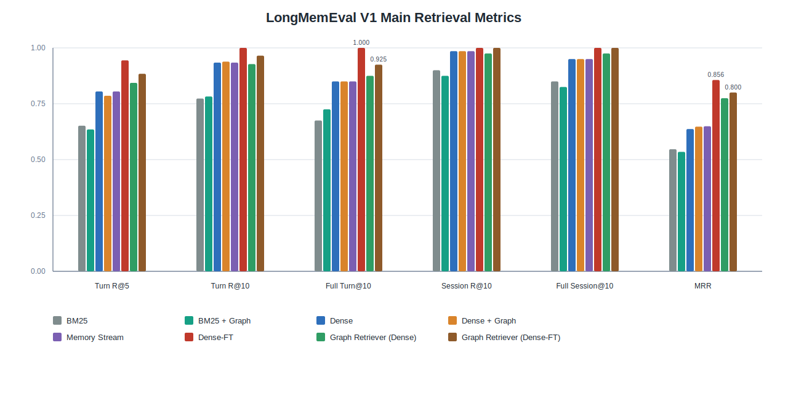
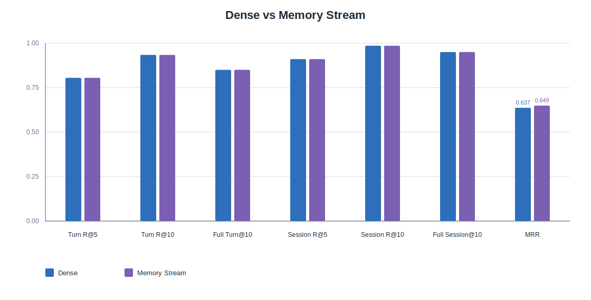

# LongMemEval V1 检索实验报告

## 1. 数据规模与评估表面

| 数据切分 | 问题数 | 平均候选记忆数 | 平均图边数 |
|---|---:|---:|---:|
| Train | 300 | 495.42 | 2828.50 |
| Dev | 100 | 493.30 | 2817.44 |
| Test | 40 | 489.60 | 2793.20 |

本次评估中，每个问题平均需要在约 `490` 条候选记忆中检索目标证据。图构建后，每个问题平均包含约 `2800` 条边，且没有孤立记忆节点。测试集边类型以实体重合边为主，占全部边约 `81.7%`；顺序边约 `15.8%`；桥接边和查询重合边合计约 `2.5%`。

从评价表面看，LongMemEval V1 当前主要提供 Turn 与 Session 两个粒度的召回、完整支持和排序位置指标。实验计划中强调的依赖路径与边恢复指标，在本批结果中均记录为 `N/A`。因此，这份表更集中地呈现“目标记忆轮次/会话是否被排入前列”，而不是直接呈现“连接证据链是否被恢复”。

## 2. 主检索指标

| 方法 | Turn Recall@5 | Turn Recall@10 | Full Turn Support@10 | Session Recall@5 | Session Recall@10 | Full Session Support@10 | MRR |
|---|---:|---:|---:|---:|---:|---:|---:|
| BM25 | 0.6517 | 0.7733 | 0.6750 | 0.8313 | 0.9000 | 0.8500 | 0.5465 |
| BM25 + Graph | 0.6350 | 0.7825 | 0.7250 | 0.7938 | 0.8750 | 0.8250 | 0.5345 |
| Dense | 0.8050 | 0.9342 | 0.8500 | 0.9104 | 0.9854 | 0.9500 | 0.6367 |
| Dense + Graph | 0.7858 | 0.9383 | 0.8500 | 0.9167 | 0.9854 | 0.9500 | 0.6475 |
| Memory Stream | 0.8050 | 0.9342 | 0.8500 | 0.9104 | 0.9854 | 0.9500 | 0.6492 |
| Dense-FT | 0.9442 | 1.0000 | 1.0000 | 0.9917 | 1.0000 | 1.0000 | 0.8563 |
| Graph Retriever (Dense) | 0.8433 | 0.9275 | 0.8750 | 0.9688 | 0.9750 | 0.9750 | 0.7749 |
| Graph Retriever (Dense-FT) | 0.8842 | 0.9650 | 0.9250 | 0.9500 | 1.0000 | 1.0000 | 0.8002 |

Dense-FT 是本次表中最强的主检索结果。相比 Dense，Dense-FT 的 `Turn Recall@10` 从 `0.9342` 提高到 `1.0000`，`Full Turn Support@10` 从 `0.8500` 提高到 `1.0000`，`MRR` 从 `0.6367` 提高到 `0.8563`。在 40 个测试问题上，Dense-FT 的完整 Turn 支持失败数为 `0`。

Memory Stream 与 Dense 的六个 Recall / Full Support 指标完全一致：`Turn Recall@5`、`Turn Recall@10`、`Full Turn Support@10`、`Session Recall@5`、`Session Recall@10`、`Full Session Support@10` 均相同。两者的完整 Turn 支持失败问题也完全一致，均为 `6` 个。Memory Stream 只在 `MRR` 上从 `0.6367` 到 `0.6492`，绝对增加 `0.0125`。

这一组对照说明，Memory Stream 的附加排序项在本批测试中没有改变 top10 命中集合，也没有改变完整支持失败集合；它主要表现为首个命中位置上的轻微变化。

## 3. 反常现象解释

Memory Stream 的结果接近 Dense，主要来自它的打分形式和调参结果。该方法的最终分数由语义相关性、recency 和 importance 加权组成；本次开发集调参选出的权重为 `relevance_weight=1.0`、`recency_weight=0.01`、`importance_weight=0.0`。也就是说，最终排序几乎完全由 Dense 相关性分数决定，recency 只保留为很小的排序扰动项。若 recency 能稳定补充语义相关性，它通常会在调参中获得更高权重；当前权重选择说明时间先验在这批任务上没有形成稳定正信号，加入后更容易改变局部顺序，而不是改变 top10 命中集合。

Graph Retriever (Dense-FT) 低于 Dense-FT，也需要结合指标上限来看。Dense-FT 在测试集的 `Turn Recall@10` 和 `Full Turn Support@10` 已经达到 `1.0000`，因此图模型只有在完全不移动正确 Turn 的前提下，才可能继续保持或提高主指标。Graph Retriever (Dense-FT) 的 Session 级 top10 指标仍为 `1.0000`，说明它仍能覆盖目标会话；回落主要发生在更细的 Turn 粒度，表现为图重打分把部分同会话或近邻记忆排到了正确 Turn 之前。这类现象更像是粒度错位：图结构帮助维持会话覆盖，但没有在该数据的 Turn 级目标上带来更稳定的排序约束。

## 4. 图相关方法观察

BM25 + Graph 相比 BM25 的 `Full Turn Support@10` 从 `0.6750` 提高到 `0.7250`，但 `Turn Recall@5`、Session 级指标和 `MRR` 同时下降。这个变化说明图重排对稀疏词面检索有局部补充，但补充结果并不均匀地传导到所有指标。

Dense + Graph 相比 Dense 的 `Turn Recall@10` 从 `0.9342` 到 `0.9383`，`MRR` 从 `0.6367` 到 `0.6475`；`Full Turn Support@10`、`Session Recall@10` 和 `Full Session Support@10` 保持不变。也就是说，在 Dense 已经覆盖较多目标记忆的情况下，图重排主要改变了少量排序位置。

Graph Retriever (Dense) 相比 Dense 的 `Turn Recall@5` 从 `0.8050` 提高到 `0.8433`，`Full Turn Support@10` 从 `0.8500` 提高到 `0.8750`，`MRR` 从 `0.6367` 提高到 `0.7749`。同时，它的 `Turn Recall@10` 从 `0.9342` 到 `0.9275`，`Session Recall@10` 从 `0.9854` 到 `0.9750`。这组结果更偏向提升靠前位置和会话覆盖质量，而不是在所有 top10 指标上同步提高。

Graph Retriever (Dense-FT) 的训练已完成，测试结果也明显高于未微调的 Dense 系列；但与 Dense-FT 本身相比，它的 `Turn Recall@5` 从 `0.9442` 到 `0.8842`，`Turn Recall@10` 从 `1.0000` 到 `0.9650`，`Full Turn Support@10` 从 `1.0000` 到 `0.9250`，`MRR` 从 `0.8563` 到 `0.8002`。Session 级 top10 指标仍保持 `1.0000`，说明该方法能够覆盖目标会话，但在更细的 Turn 粒度上没有延续 Dense-FT 的饱和结果。

## 5. 与已有证据追踪结果的参照

实验计划的核心评价目标是完整证据集合和连接关系恢复。把 LongMemEval V1 与已完成的 HotpotQA、2WikiMultiHopQA 结果放在一起看，三者呈现出的指标形态不同。

| 数据 | 平均候选记忆数 | 可展示的结构指标 | 图方法相对 Dense-FT 的形态 |
|---|---:|---|---|
| HotpotQA | 41.34 | 结构连通性指标 | Dense-FT-RGCN 的 `Full Support@10` 比 Dense-FT 高 `0.0604`，`Query-Evidence Connectivity@10` 高 `0.0589` |
| 2WikiMultiHopQA | 32.92 | 结构连通性、Path Recall、Edge Recall | Dense-FT-RGCN 的 `Full Support@5` 比 Dense-FT 高 `0.1301`，并给出 `Path Recall@10=0.9399`、`Edge Recall@10=0.8892` |
| LongMemEval V1 | 489.60 | 结构路径与边恢复列为 `N/A` | Dense-FT 的 top10 Turn / Session 完整支持达到 `1.0000`，Graph Retriever (Dense-FT) 在 Turn 粒度上低于 Dense-FT |

这个参照使 LongMemEval V1 的结果边界比较清楚：它提供了更大的长期记忆候选池，也能记录 Turn 与 Session 粒度的命中情况；但在当前表格中，结构恢复相关列没有形成可比较数值。与 HotpotQA、2WikiMultiHopQA 相比，它更像一个长期对话检索压力测试，而不是直接展示证据链恢复收益的主表。

## 6. 小结

第一，本次 LongMemEval V1 表中最稳定的主结果来自 Dense-FT。它把 Turn 与 Session 粒度的 top10 完整支持都推到 `1.0000`，并且没有留下完整 Turn 支持失败案例。

第二，Memory Stream 与 Dense 在 Recall 和 Full Support 指标上完全重合，失败集合也一致；表中唯一差异是 `MRR` 的 `0.0125` 绝对变化。这个结果更适合作为排序细节观察，而不宜单独扩展成主效应。

第三，图相关方法在局部指标上有变化：BM25 + Graph 提高了稀疏检索的 Full Turn Support，Graph Retriever (Dense) 提高了 MRR 和部分靠前指标。但在 Dense-FT 已达到 top10 饱和的设置下，Graph Retriever (Dense-FT) 没有继续提高 Turn 级主指标。

第四，与 HotpotQA 和 2WikiMultiHopQA 的证据追踪表相比，LongMemEval V1 当前更突出“长期候选池中的目标轮次检索”，而结构连通、依赖路径和边恢复的展示空间较小。后续论文主结果可以继续把结构恢复分析放在具备对应标注和可计算指标的数据上，LongMemEval V1 则作为长期记忆检索场景的补充记录。

