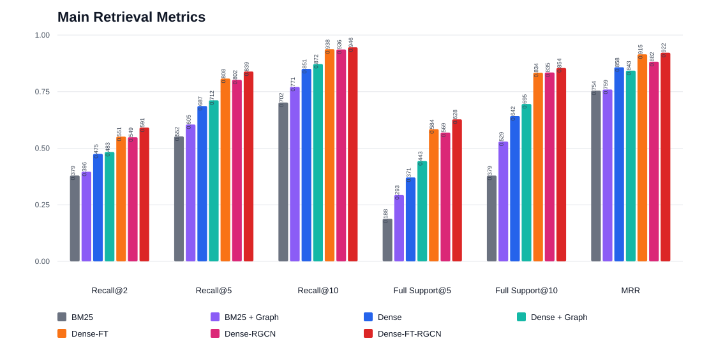
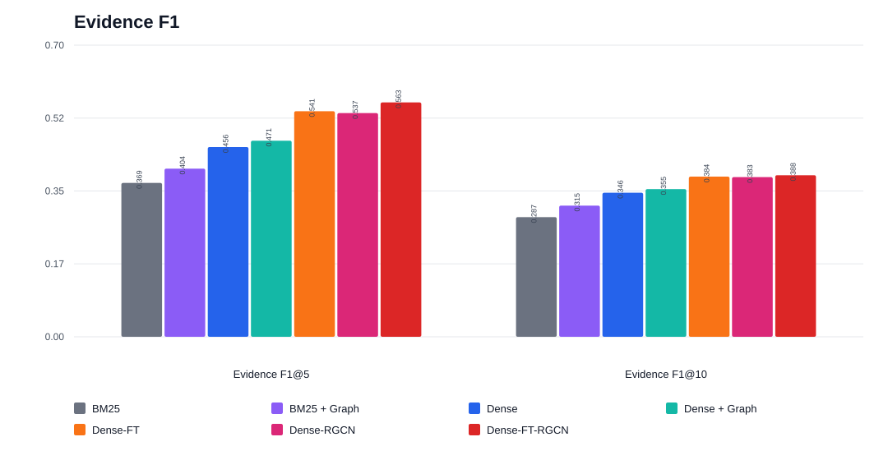
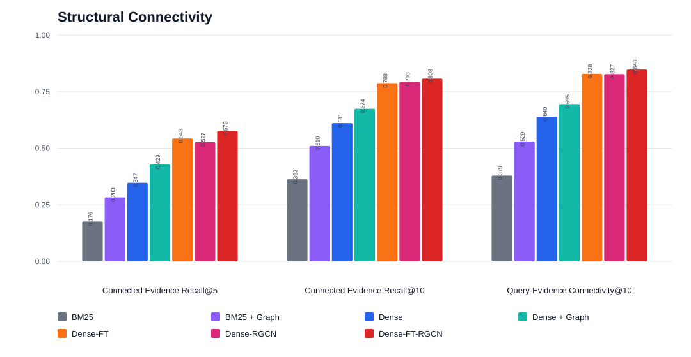
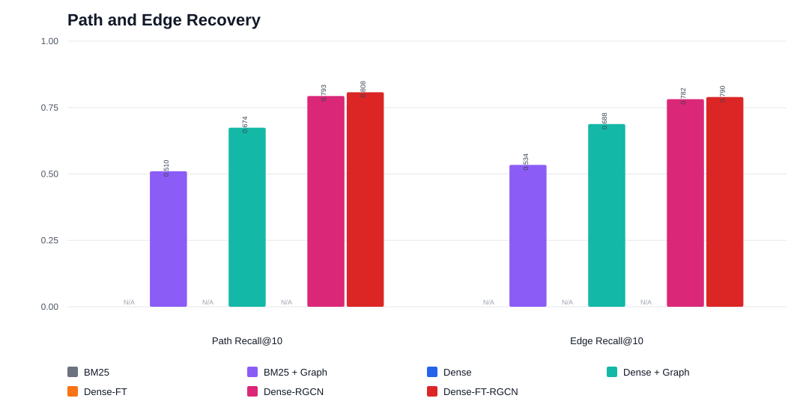
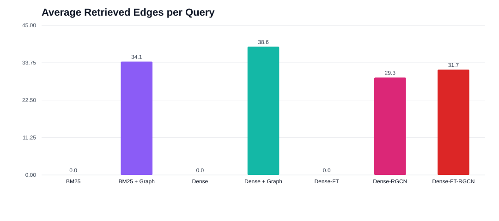
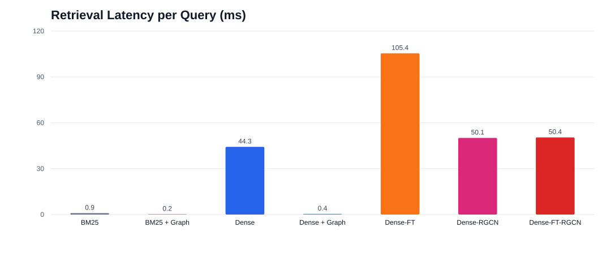

# MuSiQue 多跳证据检索基线对比报告

本报告在 MuSiQue 多跳问答数据集上，系统评估七个检索方法的证据检索能力。MuSiQue 的问题需要跨多个支持段落组合作答（含 2 至 4 跳的组合式推理），对检索器的多跳证据聚合能力提出了比一般双跳数据集更高的要求。

七个方法可以归为三组，方便横向对照：

- **稀疏与稠密文本基线**：`BM25`（词频稀疏检索）、`Dense`（通用稠密检索）、`Dense-FT`（在目标域上做过检索微调的稠密检索）。这三者只用文本相似度排序，不利用图结构。
- **轻量图重排**：`BM25 + Graph`、`Dense + Graph`。它们在对应文本种子分数之上，用一个启发式的图邻域重排来调整候选顺序。
- **R-GCN 图检索**：`Dense-RGCN`、`Dense-FT-RGCN`。它们分别以 `Dense`、`Dense-FT` 作为种子检索器，再用一个 2 层关系图卷积网络对记忆节点重新打分，输出 top-k 证据节点，并额外给出证据之间的结构化边。

这样的分组让每一组内可以直接比较"同一种子上换用不同图机制"的收益，也能比较"图机制固定、只换种子质量"的差异。

## 1. 数据规模

| 数据切分 | 问题数 | 平均候选记忆数 | 平均图边数 | 孤立记忆节点数 |
|---|---:|---:|---:|---:|
| 训练集 | 19,938 | 19.99 | 115.78 | 3,172 |
| 验证集 | 500 | 19.98 | 115.19 | 74 |
| 测试集 | 1,917 | 19.99 | 116.17 | 267 |

测试集共 1,917 道问题，每题平均约 20 条候选记忆句、约 116 条图边，top-k 截断统一取 10。相比常见的双跳数据集，MuSiQue 的候选池更小但推理链更长，因此 top10 指标并不像双跳数据集那样宽松，方法之间的差距更能反映真实的多跳聚合能力。

监督训练侧共约 46,613 个正例证据对，平均每题约 2.34 条 gold 支持句。图中边由桥接关系、实体重叠、查询重叠与顺序相邻四类构成，其中桥接边与实体重叠边占主体，为图模型提供了跨段落的连接线索。

## 2. 主检索指标

| 方法 | Recall@2 | Recall@5 | Recall@10 | Full Support@5 | Full Support@10 | MRR |
|---|---:|---:|---:|---:|---:|---:|
| BM25 | 0.3794 | 0.5520 | 0.7018 | 0.1883 | 0.3792 | 0.7544 |
| BM25 + Graph | 0.3961 | 0.6048 | 0.7709 | 0.2932 | 0.5295 | 0.7593 |
| Dense | 0.4750 | 0.6866 | 0.8507 | 0.3709 | 0.6421 | 0.8578 |
| Dense + Graph | 0.4835 | 0.7118 | 0.8720 | 0.4434 | 0.6954 | 0.8429 |
| Dense-FT | 0.5514 | 0.8079 | 0.9375 | 0.5842 | 0.8336 | 0.9148 |
| Dense-RGCN | 0.5487 | 0.8023 | 0.9363 | 0.5691 | 0.8346 | 0.8823 |
| Dense-FT-RGCN | **0.5913** | **0.8389** | **0.9460** | **0.6275** | **0.8545** | **0.9221** |

`Dense-FT-RGCN` 在全部六项主指标上均为最高，是唯一在每个维度都领先的方法。围绕它可以看出三条清晰的规律：

- **图机制对文本种子有稳定增益，且增益集中在完整证据找回上。** 稀疏种子上，`BM25 + Graph` 相对 `BM25` 的 `Full Support@10` 从 `0.3792` 升到 `0.5295`（相对 `+39.6%`），`Full Support@5` 从 `0.1883` 升到 `0.2932`（相对 `+55.7%`）。稠密种子上，`Dense + Graph` 相对 `Dense` 的 `Full Support@5` 从 `0.3709` 升到 `0.4434`（相对 `+19.5%`）。这说明图结构最擅长把"共同构成完整证据链"的句子一起顶上来，而这正是多跳问答最看重的能力。
- **R-GCN 图检索的增益远大于轻量图重排。** 同样基于 `Dense` 种子，学习式的 `Dense-RGCN` 相对 `Dense` 的 `Full Support@5` 从 `0.3709` 升到 `0.5691`（相对 `+53.4%`）、`Full Support@10` 从 `0.6421` 升到 `0.8346`（相对 `+30.0%`），增幅明显高于启发式 `Dense + Graph` 的对应提升。这表明在这种多跳、较密的图上，可学习的关系图卷积比固定规则的邻域重排更能挖出证据结构。
- **图重排可以补齐"不做微调"的差距。** 值得注意的是，仅用未微调稠密种子的 `Dense-RGCN`，在 `Recall@10`（`0.9363` vs `0.9375`）与 `Full Support@10`（`0.8346` vs `0.8336`）上已经和经过目标域微调的 `Dense-FT` 基本持平，只在 `MRR` 上仍落后（`0.8823` vs `0.9148`）。也就是说，图重排能在很大程度上替代文本微调带来的召回收益，但在把最相关证据排到最前（`MRR`）这件事上，微调种子仍有独立价值。
- **两者叠加最优。** `Dense-FT-RGCN`（微调种子 + 图检索）同时拿到两方面收益：相对 `Dense-FT`，`Recall@2` 提升 `+0.0399`（相对 `+7.2%`）、`Full Support@5` 提升 `+0.0433`（相对 `+7.4%`），且 `MRR` 回到 `0.9221`。

### 证据 F1

| 方法 | Evidence F1@5 | Evidence F1@10 |
|---|---:|---:|
| BM25 | 0.3693 | 0.2873 |
| BM25 + Graph | 0.4037 | 0.3149 |
| Dense | 0.4555 | 0.3458 |
| Dense + Graph | 0.4706 | 0.3545 |
| Dense-FT | 0.5414 | 0.3844 |
| Dense-RGCN | 0.5369 | 0.3833 |
| Dense-FT-RGCN | **0.5627** | **0.3878** |

`Evidence F1` 同时约束精确率与召回率。所有方法的 `F1@10` 都低于 `F1@5`，这是因为把返回数放宽到 10 会引入更多非证据句，拉低精确率——在平均只有约 2.34 条 gold 支持句的 MuSiQue 上尤为明显。`Dense-FT-RGCN` 在两个位置都最高，说明它在扩大召回的同时对精确率的损耗控制得最好。

## 3. 结构指标

| 方法 | Connected Evidence Recall@5 | Connected Evidence Recall@10 | Query-Evidence Connectivity@10 |
|---|---:|---:|---:|
| BM25 | 0.1763 | 0.3631 | 0.3792 |
| BM25 + Graph | 0.2827 | 0.5102 | 0.5295 |
| Dense | 0.3474 | 0.6109 | 0.6395 |
| Dense + Graph | 0.4288 | 0.6740 | 0.6948 |
| Dense-FT | 0.5430 | 0.7877 | 0.8284 |
| Dense-RGCN | 0.5274 | 0.7934 | 0.8273 |
| Dense-FT-RGCN | **0.5759** | **0.8075** | **0.8477** |

结构连通性衡量返回证据在图上是否彼此连通、是否能与问题构成完整推理链。`Dense-FT-RGCN` 三项全部最高，`Query-Evidence Connectivity@10` 达到 `0.8477`，相对 `BM25` 的 `0.3792` 高出一倍以上，相对 `Dense-FT` 的 `0.8284` 也有稳定领先。这说明图检索不只是找回更多正确句子，还更倾向于选出在图上相互连通、能共同支撑答案的节点组合。

### 路径与边恢复

| 方法 | Path Recall@10 | Edge Recall@10 |
|---|---:|---:|
| BM25 | N/A | N/A |
| BM25 + Graph | 0.5102 | 0.5341 |
| Dense | N/A | N/A |
| Dense + Graph | 0.6740 | 0.6880 |
| Dense-FT | N/A | N/A |
| Dense-RGCN | 0.7934 | 0.7818 |
| Dense-FT-RGCN | **0.8075** | **0.7896** |

`Path Recall@10` 与 `Edge Recall@10` 衡量方法对 gold 依赖路径与依赖边的恢复能力，只有会输出结构化边的图方法才能给出这两项，纯文本基线（`BM25`、`Dense`、`Dense-FT`）记为 `N/A`。在能对比的四个图方法里，R-GCN 图检索显著优于轻量图重排：`Dense-RGCN` 的 `Path Recall@10=0.7934` 明显高于 `Dense + Graph` 的 `0.6740`；`Dense-FT-RGCN` 进一步升至 `0.8075`（`Edge Recall@10=0.7896`），是路径与边恢复上最强的方法。这一维度是纯文本检索完全不具备的能力，也是图方法在多跳场景下最有辨识度的优势。

## 4. 效率指标

| 方法 | 平均返回节点数 | 平均返回边数 |
|---|---:|---:|
| BM25 | 10.00 | 0.00 |
| BM25 + Graph | 10.00 | 34.11 |
| Dense | 10.00 | 0.00 |
| Dense + Graph | 10.00 | 38.57 |
| Dense-FT | 10.00 | 0.00 |
| Dense-RGCN | 10.00 | 29.30 |
| Dense-FT-RGCN | 10.00 | 31.68 |

所有方法都稳定返回 10 个证据节点。差异在于结构化输出：三个纯文本基线不产生边，而图方法平均额外返回约 29–39 条证据边。这些边把离散的证据句连成可追溯的推理链，为下游的答案生成与可解释性提供了文本检索没有的结构信息。R-GCN 图检索返回的边数（约 29–32 条）略少于轻量图重排（约 34–39 条），但从第 3 节的路径/边恢复看，它返回的边更贴合 gold 依赖结构，是"更少但更准"的结构输出。

| 方法 | 检索耗时 / Query |
|---|---:|
| BM25 | 0.91 ms |
| BM25 + Graph | 0.23 ms |
| Dense | 44.27 ms |
| Dense + Graph | 0.44 ms |
| Dense-FT | 105.44 ms |
| Dense-RGCN | 50.09 ms |
| Dense-FT-RGCN | 50.44 ms |

需要说明这里的耗时口径：图方法（含轻量图重排与 R-GCN 图检索）统计的是检索评估阶段的耗时，不包含图结构的构建时间，而图构建是可以离线预处理、在多次查询间摊薄的一次性开销。因此表中图方法的绝对耗时会明显偏低，不能与纯文本基线直接横向相减比较（例如 `Dense + Graph` 的评估耗时低于其种子 `Dense`，正是因为前者不计入建图时间）。可以稳妥得到的结论是：稀疏检索的量级远低于稠密检索；R-GCN 图检索在检索阶段引入了额外的消息传递与节点打分开销，处在数十毫秒量级。要得到端到端的公平延迟对比，需要把图构建时间一并计入并在统一条件下重测，这里的数值仅反映检索评估阶段的量级，不作为方法优劣的判据。

## 5. 小结

- 在 MuSiQue 这一更长推理链的数据集上，`Dense-FT-RGCN`（微调种子 + R-GCN 图检索）在全部主检索指标与全部结构指标上均为最优，是综合能力最强的方法。
- 图机制对任何文本种子都能带来稳定增益，且增益最集中在完整证据找回（`Full Support`）与结构连通性上——这正是多跳问答的核心诉求。
- 可学习的 R-GCN 图检索明显强于启发式轻量图重排：无论是完整证据找回还是路径/边恢复，前者的提升幅度都更大。
- 图重排能在召回类指标上很大程度替代文本微调的收益（未微调的 `Dense-RGCN` 在 `Recall@10`、`Full Support@10` 上已追平 `Dense-FT`），但要把最相关证据排到最前（`MRR`），微调种子仍有独立价值；两者叠加得到最优结果。
- 图方法独有的价值在于结构化输出：平均额外返回约 29–39 条证据边，并能恢复 gold 依赖路径与边，这是纯文本检索完全不具备的能力，代价是数十毫秒量级的额外检索开销。
