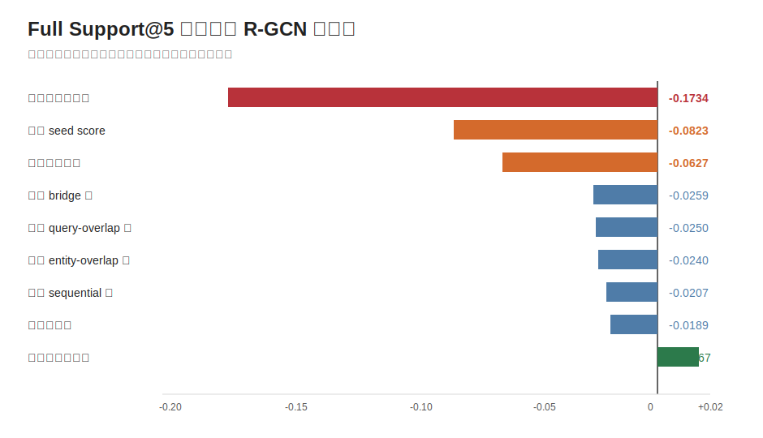
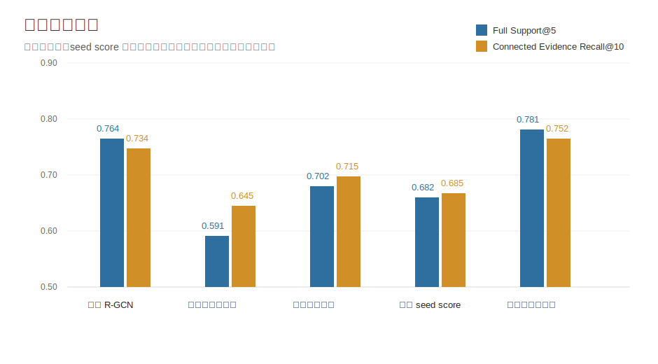
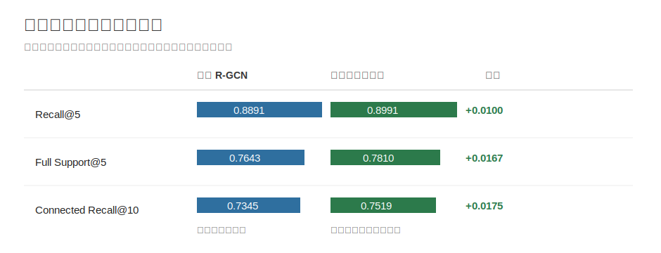

# Phase 2 R-GCN 消融实验分析报告

## 1. 核心结论

这组消融实验回答的是：R-GCN 检索器的收益主要来自哪里。

最明确的结论是：**图消息传递是主要收益来源**。去掉图消息传递后，`Full Support@5` 从 `0.7643` 降到 `0.5909`，下降 `0.1734`，远大于其它组件。这说明模型不是只靠候选段落的初始相关性排序，而是在利用图结构组织多跳证据。

第二层关键因素是 **seed score** 和 **边类型建模**。去掉 seed score 后，`Full Support@5` 下降 `0.0823`；不区分边类型后下降 `0.0627`。也就是说，初始检索分数提供起点，图结构和边类型负责继续传播与重排。

## 2. 主结果现象

`Full Support@5` 衡量前 5 个检索结果是否找全完整 supporting facts，是多跳证据检索里最关键的指标。

| 消融项 | Recall@5 | Full Support@5 | Connected Evidence Recall@10 |
|---|---:|---:|---:|
| 完整 R-GCN | 0.8891 | 0.7643 | 0.7345 |
| 去掉图消息传递 | 0.7989 | 0.5909 | 0.6451 |
| 去掉 seed score | 0.8431 | 0.6820 | 0.6850 |
| 不区分边类型 | 0.8578 | 0.7016 | 0.7154 |
| 去掉边权重 | 0.8783 | 0.7454 | 0.7224 |
| 去掉单一种边 | 约 0.8760-0.8791 | 约 0.7384-0.7436 | 约 0.7093-0.7286 |
| 只使用随机负例 | 0.8991 | 0.7810 | 0.7519 |

现象可以概括为三点：去掉整张图下降最大；去掉单一种边都会下降但幅度较小；只使用随机负例反而略高于完整模型，说明当前困难负例策略还没有稳定带来收益。

## 3. 图结构为什么重要

多跳问答需要找回的是一组互相支撑的证据，而不是单个相关段落。去掉图消息传递后三个指标同时下降：

| 指标 | 完整 R-GCN | 去掉图消息传递 | 下降 |
|---|---:|---:|---:|
| Recall@5 | 0.8891 | 0.7989 | -0.0902 |
| Full Support@5 | 0.7643 | 0.5909 | -0.1734 |
| Connected Evidence Recall@10 | 0.7345 | 0.6451 | -0.0894 |

其中 `Full Support@5` 下降最大，说明图结构最直接改善的是“整组证据是否能一起出现”。这是 Phase 2 方法区别于普通段落排序的核心价值。

## 4. seed score 与边类型

seed score 是初始排序信号。去掉它后，模型仍有图，但起点变弱，`Full Support@5` 降到 `0.6820`。

边类型建模用于区分不同证据关系。实体重叠、桥接关系、顺序邻近、问题词重叠不应完全等价；不区分边类型后，`Full Support@5` 降到 `0.7016`。

单边类型的影响更像局部贡献：

| 去掉的边类型 | Full Support@5 下降 | Connected Evidence Recall@10 下降 |
|---|---:|---:|
| bridge | -0.0259 | -0.0093 |
| entity-overlap | -0.0240 | -0.0252 |
| sequential | -0.0207 | -0.0098 |
| query-overlap | -0.0250 | -0.0058 |

单一种边都不是决定性来源；图结构收益来自多种关系共同传播。

## 5. 困难负例与总括

只使用随机负例的版本在本次结果中略高于完整 R-GCN：

这个结果不应解释为“困难负例无效”。更稳妥的结论是：**当前困难负例策略没有在这组训练预算下转化为稳定收益**，后续需要重新调负例比例、难度或损失权重。

完整 R-GCN 的平均检索延迟是 `87.08 ms/query`；去掉图消息传递后降到 `80.79 ms/query`，但质量损失很大。因此当前不应为了这点速度收益放弃图结构。

总体来看，本组消融已经支持 Phase 2 的核心判断：R-GCN 的收益主要来自图消息传递，seed score 和边类型建模提供进一步增益，困难负例策略仍需重新调整。
