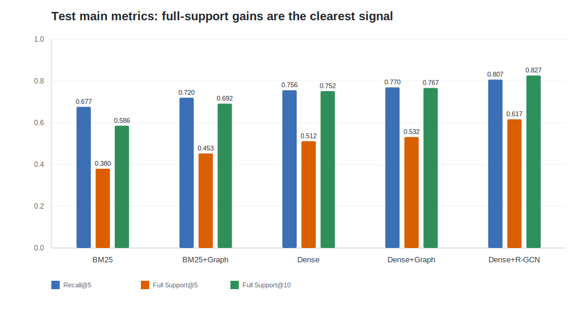
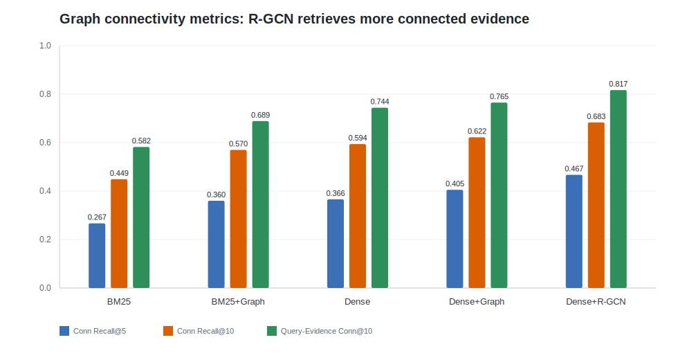
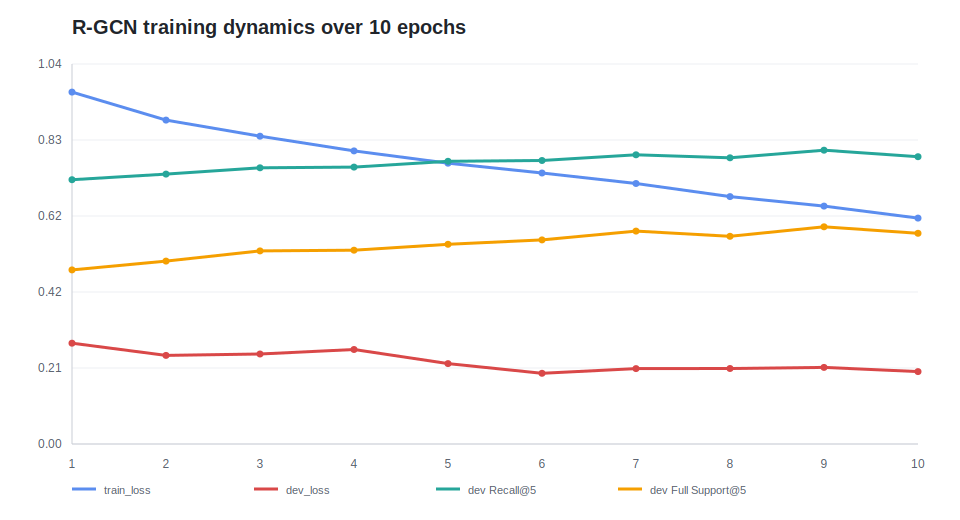
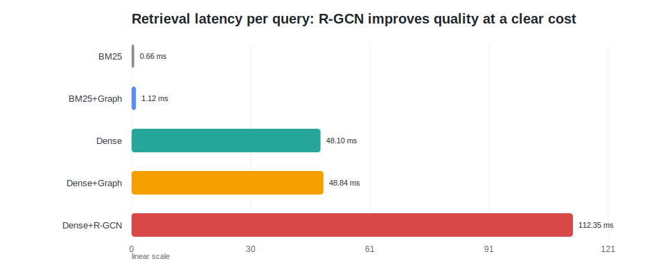

# Phase 2 可训练 R-GCN 全量训练效果报告

本报告基于 `runs/rgcn_full_train` 下的训练、测试、聚合表和失败样例文件整理。该次运行按 manifest 配置从 HotpotQA 中选取 `train=5000`、`dev=500`、`test=1000` 个 task/example；这里的数量指本次 run 的输入规模，不代表 HotpotQA 原始 split 总量。该运行用于观察 Phase 2 可训练 R-GCN 检索器相对 BM25、Dense 和非训练 graph rerank 的实际收益。

## 1. 核心结论

本次 `dense_rgcn_graph_retriever` 已经形成可训练 R-GCN 检索链路，并在 test split 上超过所有非训练基线。效果最明显的不是单个首位排序指标，而是“能否同时召回完整证据”和“召回证据是否在图结构上连通”：相对 `dense_graph_rerank`，R-GCN 的 `Full Support@5` 从 `0.532` 提升到 `0.617`，相对提升约 `16.0%`；`Full Support@10` 从 `0.767` 提升到 `0.827`，相对提升约 `7.8%`；`Connected Evidence Recall@10` 从 `0.622` 提升到 `0.683`，相对提升约 `9.8%`。

需要同时保留的边界是：该方法仍是预构图上的可训练节点打分器，不训练图构造本身，也不直接训练 top-k 选择规则。当前文本 embedding / dense encoder 是 frozen 的，未纳入反向传播；真正被训练的是 embedding 与节点特征之后的 input projection、R-GCN message passing 和 evidence scorer。因此它的主要收益体现在证据集合覆盖和结构性召回上，而不是把 MRR 大幅拉开。

## 2. 主指标对比

| 方法 | Recall@5 | Full Support@5 | Full Support@10 | MRR |
|---|---:|---:|---:|---:|
| bm25 | 0.6766 | 0.380 | 0.586 | 0.8228 |
| bm25_graph_rerank | 0.7202 | 0.453 | 0.692 | 0.8157 |
| dense | 0.7564 | 0.512 | 0.752 | 0.8538 |
| dense_graph_rerank | 0.7701 | 0.532 | 0.767 | 0.8482 |
| dense_rgcn_graph_retriever | **0.8071** | **0.617** | **0.827** | **0.8550** |

从表中可以看出，R-GCN 的优势集中在证据覆盖深度：

- 相对 `dense`：`Recall@5` 从 `0.7564` 提升到 `0.8071`，相对提升约 `6.7%`；`Full Support@5` 从 `0.512` 提升到 `0.617`，相对提升约 `20.5%`；`Full Support@10` 从 `0.752` 提升到 `0.827`，相对提升约 `10.0%`。
- 相对 `dense_graph_rerank`：`Recall@5` 从 `0.7701` 提升到 `0.8071`，相对提升约 `4.8%`；`Full Support@5` 从 `0.532` 提升到 `0.617`，相对提升约 `16.0%`；`Full Support@10` 从 `0.767` 提升到 `0.827`，相对提升约 `7.8%`。
- `MRR` 只从 `dense_graph_rerank` 的 `0.8482` 提升到 `0.8550`，相对提升约 `0.8%`。这说明当前收益不是主要来自“第一个正确证据更靠前”，而是来自 top-5/top-10 中更完整地覆盖多条 gold evidence。

## 3. 图结构指标

| 方法 | Connected Evidence Recall@5 | Connected Evidence Recall@10 | Query-Evidence Connectivity@10 |
|---|---:|---:|---:|
| bm25 | 0.267 | 0.449 | 0.582 |
| bm25_graph_rerank | 0.360 | 0.570 | 0.689 |
| dense | 0.366 | 0.594 | 0.744 |
| dense_graph_rerank | 0.405 | 0.622 | 0.765 |
| dense_rgcn_graph_retriever | **0.467** | **0.683** | **0.817** |

这组指标更直接反映 Phase 2 图方法的作用。R-GCN 相对 `dense_graph_rerank` 的 `Connected Evidence Recall@5` 从 `0.405` 提升到 `0.467`，相对提升约 `15.3%`；`Connected Evidence Recall@10` 从 `0.622` 提升到 `0.683`，相对提升约 `9.8%`；`Query-Evidence Connectivity@10` 从 `0.765` 提升到 `0.817`，相对提升约 `6.8%`。这说明训练后的 scorer 不只是挑选语义相似节点，还更倾向于把与问题和其他证据存在结构关联的节点保留在 top-k 结果中。

`Path Recall@10` 和 `Edge Recall@10` 在本次聚合表中为 `N/A`，对应当前 HotpotQA evidence labels 未提供可直接评估的 gold dependency path/edge；因此这里不把这两项解释为模型失败。

## 4. 可训练 R-GCN 的训练状态

本次训练配置为 `full_rgcn`：2 层 R-GCN，hidden dim `256`，dropout `0.1`，AdamW，learning rate `1e-4`，batch size `16`，启用 `pos_weight`。模型使用 `bridge`、`entity_overlap`、`query_overlap`、`sequential` 四类基础边，并展开为带方向的 relation vocabulary。节点侧使用 frozen text embedding、dense seed score、seed rank percentile、question-node indicator 等特征。

当前实现没有 fine-tune `models/intfloat-e5-base-v2`。文本 encoder 只负责生成 query/memory node embedding，训练时这些 embedding 作为固定输入进入 `EvidenceScoringModel`；模型训练发生在 input projection、R-GCN graph encoder 和 scorer 上。这一点使本次结果更接近“冻结语义表示 + 可训练图结构 scorer”的验证，而不是端到端 dense retriever fine-tuning。

训练集构造了 `95318` 个 pair，其中正例 `11929` 个，负例 `83389` 个，正负比例约 `1:7.0`。负例不是均匀随机样本，而是由 easy random、hard BM25、hard dense、hard graph neighbor 共同构成；其中 hard BM25 和 hard dense 都是更容易与 gold evidence 混淆的困难负例。训练 loss 从 `0.9621` 降至 `0.6177`，说明可训练部分在持续拟合监督信号。

训练曲线中 `train_loss` 明显大于 `dev_loss`，主要来自评估口径差异：训练 loss 使用带 `pos_weight` 的 BCE，正例权重约等于负正比 `7.0`，并且训练 batch 专门包含困难负例；dev loss 则在 full-ranking batch 上计算不带 `pos_weight` 的 BCE。两者不适合直接按同一标尺比较，因此这里更关注 dev retrieval metrics 的变化。最佳 dev composite 出现在 epoch 9：`dev Recall@5=0.8032`、`dev Full Support@5=0.594`、`dev Full Support@10=0.806`、`best_dev_metric=0.7043`。epoch 10 虽然 dev loss 继续下降到 `0.1979`，但 `dev Recall@5` 和 Full Support 指标回落，说明 loss 与最终检索指标并非完全同步。

## 5. 效率代价

| 方法 | Retrieval Latency / Query | Avg Retrieved Edges |
|---|---:|---:|
| bm25 | 0.66 ms | 0.000 |
| bm25_graph_rerank | 1.12 ms | 33.810 |
| dense | 48.10 ms | 0.000 |
| dense_graph_rerank | 48.84 ms | 35.171 |
| dense_rgcn_graph_retriever | **112.35 ms** | 27.662 |

R-GCN 的质量提升伴随明显推理开销。相对 `dense`，单 query latency 从 `48.10 ms` 到 `112.35 ms`，约增加 `133.6%`；相对 `dense_graph_rerank`，从 `48.84 ms` 到 `112.35 ms`，约增加 `130.1%`。这说明当前实现已经证明了 trainable graph scorer 的有效性，但还不能把性能提升视为“免费获得”。

表中的 `Index Build Time=0.0` 和 `Graph Construction Time=0.0` 更像是当前聚合字段未记录对应阶段耗时，而不是字面意义上的零成本构建；因此效率判断主要依据 retrieval latency。

## 6. 当前仍存在的问题

1. `Full Support@10=0.827` 表明仍有约 `17.3%` 的 test 样本无法在 top-10 中完整覆盖 gold evidence。`debug/failure_cases_dense_rgcn_graph_retriever.jsonl` 中记录了 50 条 capped failure cases，典型失败形态是 top-k 中已有部分 gold node，但仍缺少另一条或多条 supporting evidence。
2. MRR 提升很小，说明模型对“首个正确证据的位置”改善有限。当前 R-GCN 更像是在增强证据集合覆盖，而不是显著改写最前排排序。
3. 推理延迟从 dense 系列的约 `48 ms/query` 上升到 `112 ms/query`，这是本次实现最明确的工程代价。
4. epoch 10 的 loss 继续下降但 dev 支持率回落，说明训练目标和最终检索指标并非完全一致；当前模型选择更依赖 dev composite，而不是单看 BCE loss。

总体来看，这次 Phase 2 的 R-GCN 子轨道已经完成“冻结 embedding 输入、可训练图 scorer、参与 test 对比、并在结构性证据召回上超过非训练图 rerank”的阶段目标。当前结果支持把 `dense_rgcn_graph_retriever` 作为 Phase 2 trainable graph retriever 的有效实现版本，同时也清楚暴露了推理成本和剩余 full-support failure 的问题。
