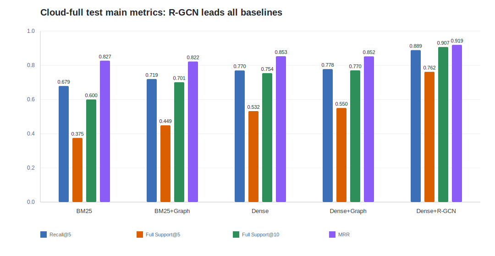
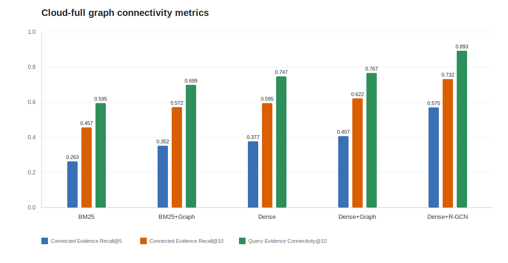
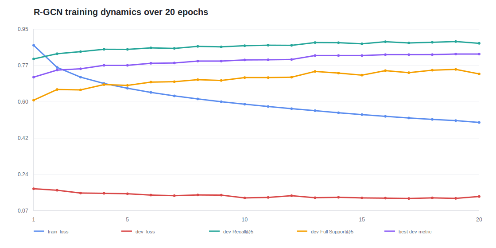
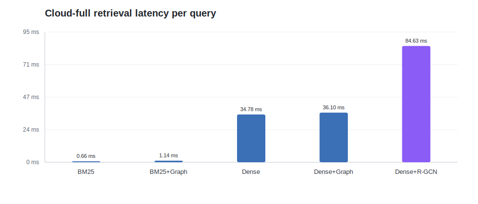

# Phase 2 R-GCN 阶段进展与效果报告

## 1. 当前进展定位

当前结果对应 Phase 2 中的“可训练图检索器”子任务：已经完成 `dense_rgcn_graph_retriever` 的训练、测试和结果汇总，并与 `bm25`、`dense`、`bm25_graph_rerank`、`dense_graph_rerank` 做了同一 test split 上的对比。

对照 Phase 2 要求，目前我还没有完成整个 Phase 2。原始要求包括 Dense-FT、Memory Stream、GraphRAG、edge ablations，以及 main/path/ablation/efficiency 表。当前完成的是其中 “Ours: Trainable Graph Retriever” 这一条主线；Dense-FT、Memory Stream、GraphRAG baseline 和系统性 edge ablation 还没有全部补齐。因此本报告应理解为 Phase 2 的阶段性进展报告，而不是完整 Phase 2 终稿。

本阶段最重要的结论是：可训练 R-GCN 已经不只是跑通链路，而是在 evidence retrieval 的主要指标上明显超过非训练图重排版本。尤其是完整证据找回和结构连通性指标提升明显，说明训练后的图节点打分器确实学到了比固定 graph rerank 权重更有效的排序信号。

## 2. 当前实现方法

当前方法是一个 dense-seeded R-GCN evidence node scorer。它不直接生成答案，而是针对每个 query 和 memory graph，对 memory sentence node 打分并输出 top-k evidence nodes。

整体结构如下：

1. 文本编码：query 和 memory sentence 使用 `intfloat/e5-base-v2` 风格的 dense embedding。当前 embedding encoder 是 frozen 的，没有做端到端 fine-tuning。
2. 节点初始特征：每个节点输入包含文本 embedding，并拼接 seed retrieval 相关数值特征，例如 dense seed score、seed rank percentile，以及 question-node indicator。
3. 输入投影：`encoder_dim + node_feature_dim` 先经过一层 `Linear -> ReLU -> Dropout`，投影到 hidden state。
4. 图编码：使用 2 层 R-GCN，hidden dim 为 `256`。边类型包括 `bridge`、`entity_overlap`、`query_overlap`、`sequential`，并按方向展开为 relation id。当前 typed relation transform 为每类 relation 使用独立线性变换。
5. 节点打分：scorer MLP 输入为 `[h_node, h_query, h_node * h_query, sample_node_features]`，结构为 `Linear -> ReLU -> Dropout -> Linear`，也就是一层 hidden MLP，输出每个候选节点的 evidence logit。
6. 训练目标：使用 gold evidence node 作为正例，随机负例、BM25 hard negative、dense hard negative 和 graph-neighbor hard negative 作为负例，先用 BCE loss 训练 evidence/non-evidence 分类。

这个设计的边界也比较清楚：当前训练的是图上的节点 scorer，不训练图构造规则本身；图边仍由规则生成，top-k 截断也不是直接训练目标。因此当前结果说明“在已有 evidence graph 上训练节点排序有效”，还不能说模型已经学会自动构图。

## 3. 主指标效果

| 方法 | Recall@2 | Recall@5 | Recall@10 | Evidence F1@5 | Evidence F1@10 | Full Support@5 | Full Support@10 | MRR |
|---|---:|---:|---:|---:|---:|---:|---:|---:|
| bm25 | 0.4738 | 0.6788 | 0.8127 | 0.4309 | 0.3101 | 0.3750 | 0.6004 | 0.8270 |
| bm25_graph_rerank | 0.4818 | 0.7194 | 0.8610 | 0.4569 | 0.3295 | 0.4490 | 0.7011 | 0.8222 |
| dense | 0.5448 | 0.7697 | 0.8887 | 0.4882 | 0.3404 | 0.5320 | 0.7540 | 0.8530 |
| dense_graph_rerank | 0.5386 | 0.7777 | 0.8946 | 0.4938 | 0.3430 | 0.5503 | 0.7703 | 0.8521 |
| dense_rgcn_graph_retriever | **0.6695** | **0.8888** | **0.9582** | **0.5665** | **0.3688** | **0.7618** | **0.9070** | **0.9195** |

R-GCN 在表中所有主指标上都是最高。相对最强非训练图方法 `dense_graph_rerank`，提升主要体现在以下几项：

| 指标 | dense_graph_rerank | dense_rgcn_graph_retriever | 绝对提升 | 相对提升 |
|---|---:|---:|---:|---:|
| Recall@5 | 0.7777 | 0.8888 | +0.1111 | +14.3% |
| Full Support@5 | 0.5503 | 0.7618 | +0.2115 | +38.4% |
| Full Support@10 | 0.7703 | 0.9070 | +0.1367 | +17.7% |
| MRR | 0.8521 | 0.9195 | +0.0673 | +7.9% |

这里最值得强调的是 `Full Support`。普通 Recall 只看 gold evidence 的平均召回比例，而 `Full Support` 要求一个样本的所有 supporting evidence 同时进入 top-k。R-GCN 的 `Full Support@10=0.9070`，说明大多数 test 样本已经能在 top-10 中完整找回 supporting evidence；相对 `dense_graph_rerank` 的 `0.7703`，提升比较明显。

MRR 也有提升，说明模型不只是补全后排证据，也让首个正确 evidence 更靠前。不过从任务目标看，更关键的仍是完整证据集合能否被找全，因为这个项目评估的是 evidence tracing，而不是单个相关句子的 first hit。

## 4. 结构连通性效果

| 方法 | Connected Evidence Recall@5 | Connected Evidence Recall@10 | Query-Evidence Connectivity@10 | Path Recall@10 | Edge Recall@10 |
|---|---:|---:|---:|---|---|
| bm25 | 0.2632 | 0.4565 | 0.5948 | N/A | N/A |
| bm25_graph_rerank | 0.3520 | 0.5721 | 0.6988 | N/A | N/A |
| dense | 0.3773 | 0.5946 | 0.7473 | N/A | N/A |
| dense_graph_rerank | 0.4070 | 0.6219 | 0.7666 | N/A | N/A |
| dense_rgcn_graph_retriever | **0.5702** | **0.7318** | **0.8931** | N/A | N/A |

结构指标更能体现图方法的意义。相对 `dense_graph_rerank`，R-GCN 的 `Connected Evidence Recall@5` 从 `0.4070` 提升到 `0.5702`，`Connected Evidence Recall@10` 从 `0.6219` 提升到 `0.7318`，`Query-Evidence Connectivity@10` 从 `0.7666` 提升到 `0.8931`。

这说明训练后的模型不只是选择语义相似的句子，还更倾向于选择在图结构上能共同形成证据链的节点。对于多跳 evidence tracing，这比单纯提高 Recall 更重要。

`Path Recall@10` 和 `Edge Recall@10` 当前仍为 `N/A`，原因是 HotpotQA supporting facts 没有显式 gold dependency path / gold dependency edge 标注。当前实验能评估 evidence node 是否找全、找全后是否连通，但还不能严格评估 gold path recovery。

## 5. 训练过程与稳定性

本次训练使用 `90,025` 个训练 task，构造出 `1,715,125` 个训练 pair，其中正例 `214,644` 个，负例 `1,500,481` 个，负正比例约 `6.99:1`。负例中包含随机负例、BM25 hard negative、dense hard negative 和 graph-neighbor hard negative，因此训练信号不只是区分明显无关句子，也覆盖了更容易混淆的候选证据。

训练共 20 个 epoch。`train_loss` 从 `0.8733` 降到 `0.4975`。最佳 dev composite 出现在 epoch 19，对应 `dev Recall@5=0.8916`、`dev Full Support@5=0.7560`、`dev Full Support@10=0.9240`、`dev MRR=0.9269`。epoch 20 的 MRR 继续上升，但 Recall 和 Full Support 回落，说明最终 checkpoint 选择不能只看 loss 或单个排序指标。

## 6. 效率代价

| 方法 | Retrieval Latency / Query | Memory Size | Avg Retrieved Nodes | Avg Retrieved Edges |
|---|---:|---:|---:|---:|
| bm25 | 0.66 ms | 41.34 | 9.99 | 0.00 |
| bm25_graph_rerank | 1.14 ms | 41.34 | 9.99 | 34.24 |
| dense | 34.78 ms | 41.34 | 9.99 | 0.00 |
| dense_graph_rerank | 36.10 ms | 41.34 | 9.99 | 35.34 |
| dense_rgcn_graph_retriever | **84.63 ms** | 41.34 | 9.99 | 28.45 |

R-GCN 的检索质量提升不是免费的。它的平均检索延迟为 `84.63 ms/query`，高于 `dense` 的 `34.78 ms/query` 和 `dense_graph_rerank` 的 `36.10 ms/query`。这部分代价主要来自图模型推理阶段的 message passing 和节点 scorer。

从当前阶段看，这个结果说明质量收益已经比较明确，但后续如果要做更完整的系统评估，还需要把质量提升和推理成本放在一起比较。

## 7. 尚未完成的 Phase 2 内容

按照原始项目要求，Phase 2 不是只做 R-GCN。当前还缺少以下部分：

| 要求 | 当前状态 |
|---|---|
| Dense-FT baseline | 尚未完成 |
| Memory Stream baseline | 尚未完成 |
| GraphRAG baseline | 尚未完成 |
| Edge ablation | 尚未系统完成 |
| `ablation_results.csv` | 尚未形成完整表 |
| Path / edge gold label 评估 | HotpotQA 当前标注口径下仍不可直接评估 |
| 完整论文式实验结构 | 目前只有阶段性主结果、连通性结果和效率结果 |

